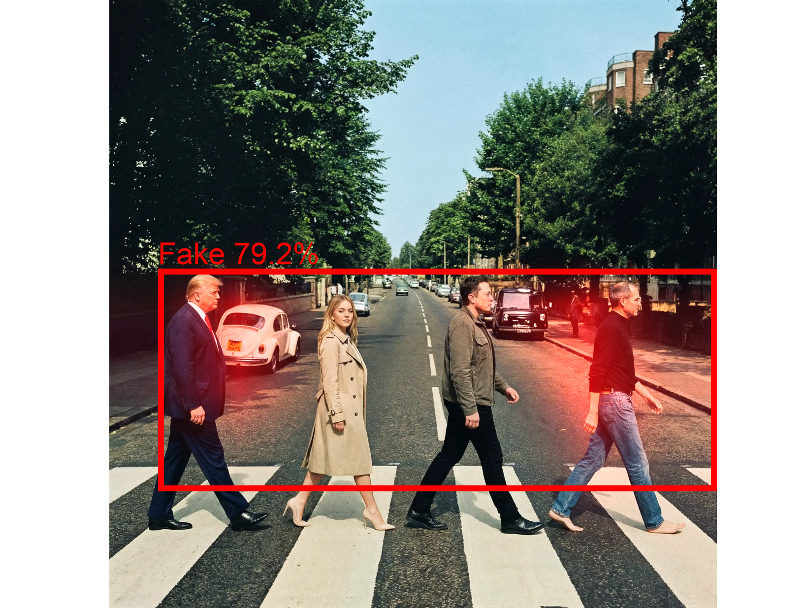

# Fake Finder Nano Banana Pro

Détecteur d'images générées par IA utilisant **MobileNetV3 Large** finetuné avec des images Nano Banana Pro pour identifier les fakes.

**Précision : (9 images sur 10)**
(Fonctionne aussi sur images difussion - Midjourney, SD, DALL-E)

*Note : les datasets d'images d'entrainement sont à télécharger sur HuggingFace 👇*



## 🔍 Installation et tester des images

```bash
# Installation de uv (si pas déjà installé)
curl -LsSf https://astral.sh/uv/install.sh | sh

# Installation des packages
uv sync

# Inférence simple avec Grad-CAM
uv run inference.py nom_image.jpg

# L'image doit être dans le répertoire images/ (images/, images/fake/ ou images/real/)

# Évaluation complète du dataset de test
uv run python inference_check_test_dataset.py
```

## 🎯 Concept Principal : Finetuning par Transfer Learning

Ce projet repose entièrement sur la technique du **transfer learning** :

- **Source** : Modèle ImageNet v3 Large (`mobilenet_v3_large-8738ca79.pth - même version que dans le doc PyTorch`)
- **Cible** : Détection générale d'images fake (SD, Midjourney, DALL-E et Nano Banana pro)
- **Méthode** : Fine-tuning du classifier uniquement (reste du modèle gélé)
- **Datasets d'entraînement** : Combinaison des datasets Midjourney/DALL-E/SD et Nano Banana Pro
- **Résultat** : `best_model_nanobanana_pro.pth`

**Avantages du transfer learning** :
- ✅ Réutilisation des connaissances pré-existantes
- ✅ Entraînement rapide avec peu de données **(1 seule Epoch)**
- ✅ Meilleures performances que l'entraînement from scratch
- ✅ Adaptation progressive du modèle général vers le cas spécifique

## 🏗️ Architecture

- **Modèle de base** : MobileNetV3-Large (transfer learning depuis ImageNet)
- **Classes** : 2 (Real / Fake)

## 🚀 Installation

```bash
# Installation des dépendances
uv sync

# Téléchargement des datasets depuis Hugging Face
uv run python download_dataset_images.py julienlucas/midjourney-dalle-sd-dataset ./AIvsReal_midjourney_dalle_sd
uv run python download_dataset_images.py julienlucas/nanobanana-pro-dataset ./AIvsReal_nanobanana_pro
```

## 📥 Sources des Images Nano Banana Pro

Collectées depuis :

- **[YouMind](https://youmind.com/fr-FR/nano-banana-pro-prompts)** - Collection de prompts et images Nano Banana Pro
- **[Higgsfield.ai](https://higgsfield.ai/nano-banana-pro-preview)** - Aperçu et exemples Nano Banana Pro
- **[Awesome Nano Banana Pro (GitHub)](https://github.com/ZeroLu/awesome-nanobanana-pro)** - Collection open-source d'exemples
- **[PromptGather.io](https://promptgather.io)** - Plateforme de collecte de prompts Nano Banana Pro
- **[Google Sheets - PromptGather](https://docs.google.com/spreadsheets/d/1GAp_yaqAX9y_K8lnGQw9pe_BTpHZehoonaxi4whEQIE/edit?gid=116507383#gid=116507383)** - Base de données de prompts avec images

## 🎓 Entraînement (Transfer Learning)

### 1. Fine-tuning SD/Midjourney/DALL-E uniquement

```bash
uv run finetune_midjourney_dalle_sd.py
```

Génère `models/best_model_midjourney_dalle_sd.pth`

### 2. Re-finetuning avec SD/Midjourney/DALL-E + Nano Banana Pro

```bash
uv run finetune_nanobananapro.py
```

Génère `models/best_model_nanobanana_pro.pth`


## 📊 Résultats

| Dataset | Accuracy |
|---------|----------|
| Midjourney/DALL-E/SD/Nano Banana Pro | 85%


## 📄 Licence

Ce projet est destiné à l'éducation, vidéo complète sur Youtube: https://www.youtube.com/@julienlucas

Mettez une ⭐ pour soutenir mon travail, c'est apprécié 🙏
